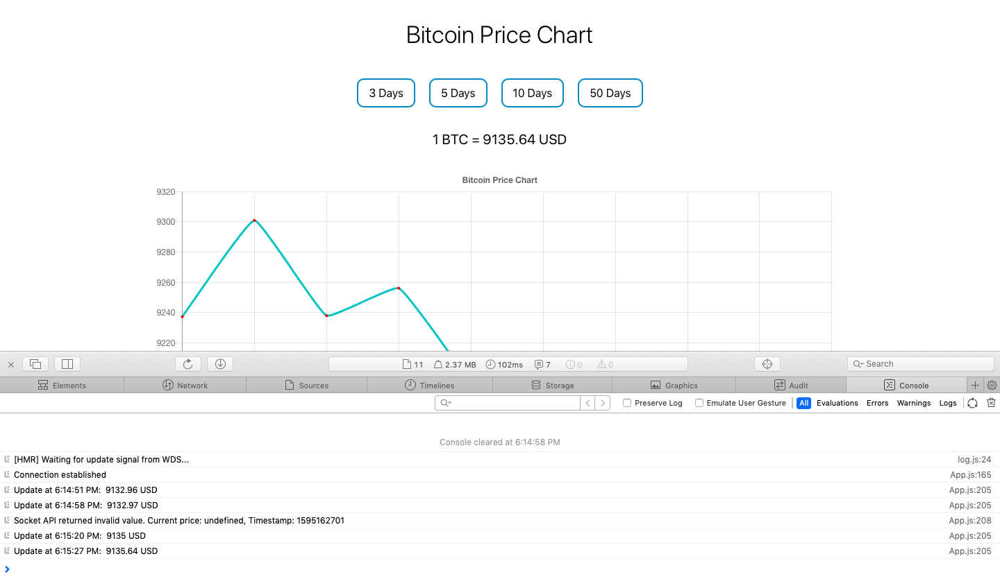

## Bitcoin Price Chart

A React app that displays a Bitcoin price chart. The app uses WebSocket connection for real time updates.

API - [CryptoCompare](https://min-api.cryptocompare.com/documentation)

Charts library - [react-chartjs-2](https://www.npmjs.com/package/react-chartjs-2)

Screenshots - 

   
   
